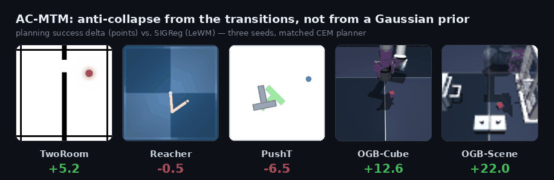
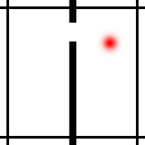
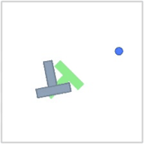
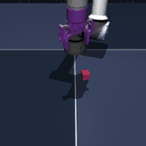
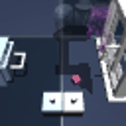
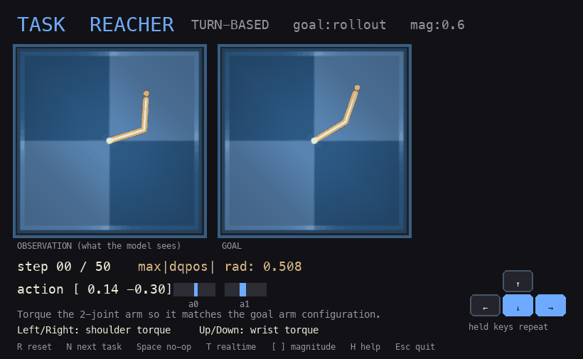

# AC-MTM — Action-Contrastive Masked Transition Modeling

### No Gaussian Required: Contrastive Inverse Dynamics for JEPA World Models

A JEPA world model has to be stopped from collapsing to a constant encoder.
Most methods do this by prescribing what the latent distribution must look
like. AC-MTM takes the pressure from the transitions instead: a training-only
inverse head must identify which action produced each latent transition, among
the other actions in the batch. A collapsed encoder gives every transition the
same query, so it cannot beat chance. The head is thrown away after training,
so the deployed model — encoder, predictor, planner, compute — is unchanged.

<p align="center">
  
</p>

<p align="center">
  <b>Paper - https://arxiv.org/abs/2608.17542</b>
</p>

> **Forked from [`lucas-maes/le-wm`](https://github.com/lucas-maes/le-wm)**
> (LeWorldModel, Maes, Le Lidec, Scieur, LeCun and Balestriero). The encoder,
> predictor, datasets, planner and training harness are theirs. This fork
> replaces the SIGReg anti-collapse term and adds the inverse-dynamics heads,
> the contrastive action loss, the diagnostics, and the OGBench Scene protocol.

## Results

Planning success (%), mean ± sd over three training seeds `{3072, 1, 2}`, same
CEM planner throughout. 200 evaluation episodes per seed on the standard tasks,
50 on Scene.

| Task | SIGReg (LeWM) | AC-MTM (ours) | Δ |
|---|:---:|:---:|:---:|
| TwoRoom | 85.5 ± 0.4 | **90.7 ± 0.6** | +5.2 |
| Reacher | 68.8 ± 0.2 | 68.3 ± 3.1 | −0.5 |
| PushT | **93.2 ± 0.2** | 86.7 ± 1.5 | −6.5 |
| OGB-Cube | 66.2 ± 0.2 | **78.8 ± 1.7** | +12.6 |
| OGB-Scene | 58.0 ± 2.0 | **80.0 ± 2.0** | +22.0 |

This is not a clean sweep. AC-MTM matches SIGReg on the standard four-task
suite and loses PushT, where the goal-relevant variable (T-block orientation)
is barely moved by the action and so gets underweighted by an action-identifying
objective. The separation shows up on the harder multi-object OGBench Scene
task, where SIGReg lands 6 points above the 52% random-policy floor and AC-MTM
lands 28 above it — 40 paired wins against 7 losses over 150 matched episodes.
`progress/experiment-log.md` is the full ledger, including the runs that failed.

## Install

```bash
uv venv --python=3.10 .venv
source .venv/bin/activate
uv pip install "stable-worldmodel[train,env]"
```

The model is ~15M parameters and trains on one GPU. Everything below assumes
`$STABLEWM_HOME` points at the in-repo cache, which is where datasets,
checkpoints, decoders and evaluation outputs land:

```bash
export STABLEWM_HOME="$PWD/.stable_worldmodel"
```

On macOS the legacy `gym==0.21.0` dependency needs the older packaging
toolchain first:

```bash
python -m ensurepip --upgrade
python -m pip install "pip<24" "setuptools==65.5.0" "wheel<0.39" "packaging<22"
python -m pip install gym==0.21.0 swig
PATH="$PWD/.venv/bin:$PATH" python -m pip install "stable-worldmodel[train,env]" pytest modal
```

## Data

The four standard datasets are LeWM's, released as HDF5 on the
[LeWM HuggingFace collection](https://huggingface.co/collections/quentinll/lewm).
Download, then:

```bash
tar --zstd -xvf archive.tar.zst
mv *.h5 "$STABLEWM_HOME"/
```

Dataset names are given without the `.h5` extension:
`config/train/data/pusht.yaml` references `pusht_expert_train`, which resolves
to `$STABLEWM_HOME/pusht_expert_train.h5`. Cube and Scene come from
[OGBench](https://github.com/seohongpark/ogbench) and are prepared by
`ogb_prep.py` and `scene_prep.py`.

## Training

`jepa.py` holds the model; `module.py` holds the predictor, action embedder and
inverse heads. Training is Hydra-configured under `config/train/`.

Four objectives share one encoder, predictor and planner, and differ only in
the anti-collapse signal:

| Config | Short name | Anti-collapse signal | Prescribes latent geometry? |
|---|---|---|---|
| `lewm` | SIGReg (LeWM) | isotropic-Gaussian marginal matching, weight 0.09 | yes |
| `lewm_masked` | MTM-MSE | inverse-action regression, `(z_t, z_{t+1}) → a_t` | no |
| `lewm_masked_action_nce` | **AC-MTM** | contrastive inverse-action identification | no |
| `lewm_accpc` | AC-CPC | contrastive *future* identification | implicit (unit sphere) |

Train AC-MTM:

```bash
python train.py --config-name=lewm_masked_action_nce data=pusht
```

Train the SIGReg baseline it is compared against:

```bash
python train.py data=pusht
```

Set your WandB `entity` and `project` in `config/train/lewm.yaml`, or override
on the command line. Training uses WandB when `$WANDB_API_KEY` is set and
otherwise writes `metrics.jsonl`, `events.jsonl`, `run_metadata.json` and
`checkpoint_state.json` to the run directory.

### Reproducing the paper runs

Every paper number uses 10 epochs, `inverse_weight=0.30`,
`action_nce_temperature=0.1`, no early stopping, and training seeds
`{3072, 1, 2}`. The `λ = 0.30` coefficient was picked once by a bounded Reacher
sweep and then left alone for every task.

```bash
for SEED in 3072 1 2; do
  for DATA in tworoom pusht reacher ogb scene; do
    python train.py --config-name=lewm_masked_action_nce data=$DATA \
      subdir=$DATA/ac_mtm_e10_s$SEED \
      seed=$SEED trainer.max_epochs=10 early_stopping.enabled=false
  done
done
```

`data=ogb` is the Cube dataset; its *eval* config is named `cube`. The two
names differ.

Checkpoints are written during training, not only at clean exit:
`<output_model_name>_weights.ckpt` is the latest resumable one,
`<output_model_name>_best_weights.ckpt` the best on validation loss.
`resume.mode=auto` continues from the latest checkpoint if one exists and
refuses to restart in a non-empty directory that has none — use a fresh
`subdir` for a clean run. The LR scheduler is step-based
`LinearWarmupCosineAnnealingLR` sized from the trainer's estimated stepping
batches, so changing `max_epochs`, `max_steps` or batch size changes the LR
curve and counts as an optimization change, not a free knob.

### How the anti-collapse signal works

Alongside the forward predictor `(z_t, a_t) → z_{t+1}`, an inverse-dynamics
head maps an adjacent latent pair `(z_t, z_{t+1})` to the action that connects
them. The head predicts the **whole coarse action block as one vector**, not
five separate actions: its output dimension is `frameskip × action_dim`
(TwoRoom: `5 × 2 = 10`), regressed in a single forward pass from the latent
pair (`InverseDynamics` in `module.py`). Two loss flavours:

- **MTM-MSE** — regress the block, `‖pred − target‖²`.
- **AC-MTM** — treat the prediction as a query and, over the `N = B(T−1)`
  transitions in the batch, classify which true action block it belongs to by
  negative squared distance (`logits[i,j] = −‖pred_i − tgt_j‖² / (τ·d_a)`,
  diagonal positive; `action_discrimination_loss`).

Under collapse every row of the AC-MTM classifier is identical, so the model
must assign one fixed probability vector to all `N` positives and the loss
cannot fall below `log N`. Inverse regression only floors at the action
variance, which is a weaker barrier — and on Reacher two of three MTM-MSE seeds
do collapse. That reliability is the reason for the contrastive form.

The negatives are the action blocks already in the batch. They are *raw*
actions, not encoder outputs, so they carry no gradient to the encoder;
enlarging the pool changes only the difficulty of the discrimination. Global
negatives would mostly add easy ones while raising the false-negative rate,
since control data repeats near-zero and saturated blocks.

The horizon-conditioned variants (`lewm_masked_h`, `lewm_ms_mtm`) use
`HorizonInverseDynamics`: they predict the first block `a_t` from a
`k`-step-apart pair `(z_t, z_{t+k}, e_k)` with a learned gap embedding, which
pushes the encoder to represent slow state variables.

The whole inverse branch is **training-only**. `rollout` and `get_cost` never
call it and it is discarded at test time.

## Planning and evaluation

Eval configs live under `config/eval/`. Set `policy` to the checkpoint path
**relative to `$STABLEWM_HOME`**, without the `_object.ckpt` suffix:

```bash
# correct
python eval.py --config-name=pusht policy=pusht/ac_mtm_e10_s3072

# wrong — the suffix is appended for you
python eval.py --config-name=pusht policy=pusht/ac_mtm_e10_s3072_object.ckpt
```

The controlled protocol used in the paper:

```bash
python eval.py --config-name=pusht policy=pusht/ac_mtm_e10_s3072 \
  eval.num_eval=200 eval.env_batch_size=10 seed=42 output.save_video=false
```

200 episodes, evaluation seed 42, goal offset 25, interaction budget 50,
CEM 300 samples / 30 elites / 30 iterations. TwoRoom-long
(`--config-name=tworoom_long`) changes only the offset and budget, to 100/150.
Scene uses 50 episodes per seed under the same trajectory-goal setup — which is
*not* the official OGBench fixed-goal protocol; that one is
`config/eval/scene_official.yaml`, and neither method solves it at this model
scale (0/250 for both).

### CEM action blocks and the three fives

`eval.py` wraps `stable_worldmodel.solver.CEMSolver` using
`config/eval/solver/cem.yaml`:

```yaml
num_samples: 300
topk: 30
n_steps: 30
plan_config:
  horizon: 5
  receding_horizon: 5
  action_block: 5
```

Three separate fives that are easy to conflate. They are independent knobs that
happen to share a value:

- **`action_block: 5`** (equal to the dataset `frameskip`) — how many raw
  simulator actions are bundled into one coarse model step. The world model
  never sees individual simulator frames; one "action token" is the whole
  `K × d`-number block bridging two adjacent coarse frames.
- **`horizon: 5`** — how many coarse steps the planner looks ahead, i.e.
  `5 × 5 = 25` raw simulator steps. Only the *final* latent is scored against
  the goal.
- **`receding_horizon: 5`** — how many coarse steps of the plan are executed
  before replanning. Equal to `horizon` here, so each plan runs in full; set it
  lower for tighter closed-loop control, and the unused tail warm-starts the
  next solve.

The model predicts the next *latent state* — not actions, and not the four
skipped simulator frames. The five actions are inputs (proposed by CEM at test
time, read from the dataset during training); the single output is `z_{t+1}`.

```text
LOW LEVEL — simulator             action_block = frameskip = K = 5
  raw steps:  | a0 a1 a2 a3 a4 | a5 a6 a7 a8 a9 | .... | a20 a21 a22 a23 a24 |
                └── block 0 ──┘   └── block 1 ──┘        └───  block 4  ────┘
  one block = K*d numbers  (TwoRoom: 5*2 = 10)

COARSE LEVEL — world model        horizon = H = 5 coarse steps  ( = 25 sim steps )
  latents:    z0 ──blk0──▶ z1 ──blk1──▶ z2 ──blk2──▶ z3 ──blk3──▶ z4 ──blk4──▶ z5

GOAL & COST
  z5  vs  z_goal  ──▶  cost = || z5 - z_goal ||^2     # only the FINAL latent

EXECUTION — receding-horizon MPC  receding_horizon = R = 5
  run R*K = 25 env.step calls, THEN re-plan from the new observation
```

`CEMSolver.solve` initialises a diagonal Gaussian over action blocks at mean
zero and unit scale, samples 300 sequences (the first forced to the current
mean), scores them with `get_cost`, keeps the 30 lowest, and refits mean and
scale to those elites per environment, horizon slot and action component. The
refit is *hard* — no step size, no variance floor — so the Gaussian collapses to
nearly a point by about iteration 15. Selection is joint over whole plans;
the refit is marginal per coordinate, so coordinates that move the cost sharpen
while irrelevant ones stay diffuse. Note the field named `var` actually holds a
standard deviation.

At the start of an episode the frame-history wrapper pre-fills its buffer by
repeating the initial observation, so the model always gets a full
`history_size`-length context. From then on the rollout conditions on its own
predicted latents, which is why latent geometry matters: an early bad latent
compounds.

## Diagnostics

The paper's claims rest on these as much as on success rates.

**Linear probes** — freeze the encoder, embed 4000 frames, ridge-regress
(`α=1`) to each privileged simulator-state coordinate. This is what shows the
PushT failure: both inverse variants keep agent position, keep most of block
position, and underencode block orientation.

```bash
python probe.py --policy pusht/ac_mtm_e10_s3072
```

**Latent surprise** — corrupt a transition and see whether prediction error
rises. An *action counterfactual* keeps the latent history but swaps in another
clip's action block; a *state discontinuity* keeps the prediction but replaces
the target future. The reported ratio is corrupted error over normal error, so
it is only comparable within a model, never across models.

```bash
python surprise_diagnostics.py --policy pusht/ac_mtm_e10_s3072 \
  --dataset pusht_expert_train
```

**Open-loop rollout visualisation** — roll the model forward under recorded
actions and write latent MSE, cosine drift curves and, with a decoder, decoded
frame grids:

```bash
python train_decoder.py task=pusht policy=pusht/ac_mtm_e10_s3072 max_samples=50000
python visualize_predictions.py task=pusht policy=pusht/ac_mtm_e10_s3072 \
  decoder.path=$STABLEWM_HOME/decoders/pusht/pusht__ac_mtm_e10_s3072/decoder.pt
```

The decoder is trained *after* the world model, with the world model frozen.
Do not add its reconstruction loss to normal training unless you are running
that specific ablation. Without `decoder.path` the script still writes latent
metrics and the horizon error plot and skips frame rendering.

**Imagined planning videos** — capture planning artifacts during eval, then
render:

```bash
python eval.py --config-name=tworoom policy=tworoom/ac_mtm_e10_s3072 \
  output.save_planning_artifacts=true
python render_planning_videos.py \
  --input "$STABLEWM_HOME/tworoom/planning_artifacts/<run-dir>" \
  --decoder "$STABLEWM_HOME/decoders/tworoom/tworoom__ac_mtm_e10_s3072/decoder.pt"
```

Capture is off by default — it adds a model rollout at every replan.

## Running on Modal

`modal_app.py` mirrors the local layout: a persistent Volume mounts at
`.stable_worldmodel` and `STABLEWM_HOME` points at it. The image pins
`stable-worldmodel==0.0.6` and `stable-pretraining==0.1.6` to stop dependency
drift during checkpoint reproduction.

```bash
pip install modal && modal setup
.venv/bin/modal run modal_app.py::upload \
  --local-path "$STABLEWM_HOME/pusht_expert_train.h5" --remote-path /pusht_expert_train.h5
```

Train and evaluate in one job:

```bash
.venv/bin/modal run --detach modal_app.py::train_then_evaluate \
  --config-name lewm_masked_action_nce --data pusht \
  --subdir pusht/ac_mtm_e10_s3072 \
  --overrides "seed=3072 trainer.max_epochs=10 early_stopping.enabled=false" \
  --eval-config-name pusht --eval-policy pusht/ac_mtm_e10_s3072 \
  --eval-overrides "eval.num_eval=200 eval.env_batch_size=10 seed=42 output.save_video=false"
```

Use the CLI's global `run --detach` so the remote app survives a local
disconnect. **Do not pass entrypoint-level `--no-wait`** — the entrypoints block
on purpose, and `--no-wait` lets Modal kill the spawned task, leaving an app
that reports `stopped` with 0 tasks while nothing runs.

Other entrypoints: `train`, `evaluate`, `decoder`, `visualize`, `probe`,
`probe_features`, `surprise_diagnostics`, `prepare_reported_assets`,
`reproduce_checkpoint`, `reproduce_reported_results`, `scene_official_chunks`,
`ogb_comparison`, `ogb_eval_matrix`, `upload`. `grep "@app.local_entrypoint" -A1
modal_app.py` lists them all.

GPU defaults are `A100-40GB` for training and `L4` for evaluation, overridable
per job:

```bash
MODAL_TRAIN_GPU=L40S MODAL_EVAL_GPU=A10 .venv/bin/modal run --detach \
  modal_app.py::train --config-name lewm_masked_action_nce --data pusht --subdir pusht/ac_mtm
```

For profiling before changing hardware, `lewm_speed` runs a bounded 300-step
probe with checkpointing off. The fields that decide it are
`timing/data_time_s`, `timing/batch_time_s`, `timing/samples_per_s` and
`gpu/max_memory_allocated_gib` — low memory use alone does not justify an H100.

### Reproducing the LeWM baselines

`prepare_reported_assets.py` streams the released LeWM datasets and converts
their HF `weights.pt` files into the `_object.ckpt` form `eval.py` expects:

```bash
.venv/bin/modal run --detach modal_app.py::prepare_reported_assets \
  --tasks tworoom,pusht,reacher,cube
.venv/bin/modal run --detach modal_app.py::reproduce_reported_results \
  --eval-overrides "output.save_video=false eval.env_batch_size=10"
```

One protocol caveat worth knowing: for TwoRoom, `config/eval/tworoom.yaml` uses
the upstream repo's current `goal_offset_steps=25, eval_budget=50`, which
reproduces the reported result scale. The longer protocol in the LeWM paper text
is available separately as `tworoom_long`, and the released checkpoint scores
much lower under it. Upstream issue #38 records maintainer confirmation that the
100/150 in the paper text was a typo. `progress/evaluation-protocol-ledger.md`
records every such decision.

## Sanity checks

```bash
python -B -m pytest -q
python -B -m py_compile jepa.py module.py train.py eval.py modal_app.py \
  prepare_reported_assets.py train_decoder.py visualize_predictions.py \
  render_planning_videos.py
python train.py --config-name=lewm_masked_action_nce data=pusht wandb.enabled=false --cfg job
```

These check the predictor shape contract, rollout action-window alignment,
config selection, script syntax, Modal importability and Hydra composition
without starting a job.

## Tasks

Five reward-free goal-conditioned continuous-control tasks. Each dataset is
offline trajectories of pixel observations and continuous actions — no rewards,
no task labels. At evaluation a goal observation is encoded and CEM optimises an
action sequence to minimise latent distance to it.

<table align="center">
<tr>
<td align="center"><b>TwoRoom</b><br></td>
<td align="center"><b>Reacher</b><br></td>
<td align="center"><b>PushT</b><br></td>
<td align="center"><b>OGB-Cube</b><br></td>
<td align="center"><b>OGB-Scene</b><br></td>
</tr>
</table>

| Task | Domain | Obs | Action | Goal-relevant state | Source |
|---|---|:---:|:---:|---|---|
| TwoRoom | 2D navigation | 224² RGB | 2D | agent position (active) | PLDM / stable-worldmodel |
| Reacher | articulated reach | 224² RGB | 2D | joint config (active) | DM Control Suite |
| PushT | 2D push manipulation | 224² RGB | 2D | block pose (passive) | Diffusion Policy / IBC |
| OGB-Cube | 3D manipulation | 224² RGB | 5D | cube pose (grasped) | OGBench |
| OGB-Scene | 3D multi-object | 224² RGB | 5D | drawer, window, buttons, cube | OGBench |

They stress different failure modes. **TwoRoom** is low intrinsic dimension —
displacement is directly visible and fully action-coupled. **Reacher** actuates
both joints, so goal-relevant state is tightly coupled to the action, the regime
where dynamics-derived anti-collapse should work well. **PushT** is the
diagnostic one: the agent controls only itself and the T-block moves passively
on contact, so its orientation is goal-relevant but not needed to solve the
dynamics objective. **OGB-Cube** moves its object by grasping rather than
pushing. **OGB-Scene** is the hardest: one arm, several interacting objects, so
a useful latent has to hold multiple slow variables at once.

> Sources: PushT from Florence et al., *Implicit Behavioral Cloning* (CoRL
> 2022), via Chi et al., *Diffusion Policy* ([RSS 2023](https://arxiv.org/abs/2303.04137)).
> Reacher from Tassa et al., *DeepMind Control Suite* ([arXiv 2018](https://arxiv.org/abs/1801.00690)).
> TwoRoom from Sobal et al., *Learning and Planning in Latent World Models*, via
> [`stable-worldmodel`](https://github.com/galilai-group/stable-worldmodel).
> Cube and Scene from Park et al., *OGBench* ([ICLR 2025](https://arxiv.org/abs/2410.20092)).

`play.py` additionally exposes six broader OGB tasks for interactive
stress-testing — `puzzle-4x4-play-v0`, `puzzle-4x5-play-v0`,
`antmaze-teleport-navigate-v0`, `powderworld-medium-play-v0`,
`antmaze-large-stitch-v0` and `antsoccer-medium-stitch-v0`. Single-seed
screening results are in `progress/evaluations/ogb-broad-corrected-s3072/`.

Media in this section was generated with `make_task_media.py`; the hero
animation with `scripts/make_hero_gif.py`.

## Human play demo

`play.py` opens the same tasks but lets you drive them from the keyboard. Left
panel is the current observation, right panel the goal, and the HUD shows the
native success distance and action vector. No checkpoint or downloaded dataset
is needed — the demo samples reachable goals from the simulators.

<p align="center">
  
</p>

```bash
uv pip install pygame ogbench
python play.py --task reacher   # or pusht / tworoom / cube
python play.py --task puzzle4x4 # or puzzle4x5
python play.py --list
python play.py --selftest-all   # headless check, no window
```

Turn-based by default: each keypress advances one `env.step`. Press `T` or pass
`--realtime` to step continuously.

| Key | Action |
|---|---|
| `Esc` | Quit. `Q` also quits where `Q` is not an action key. |
| `R` | Reset to a new episode / seed. |
| `N` or `Tab` | Next task. |
| `Space` | No-op step. |
| `T` | Toggle turn-based vs. real-time. |
| `[` / `]` | Decrease / increase action magnitude. |
| `S` | Screenshot to `/tmp/play_<task>_<step>.png`. |
| `H` | Toggle help text. |

| Task | Controls |
|---|---|
| PushT | Arrow keys move the pusher. |
| TwoRoom | Arrow keys move the point agent. |
| Reacher | Left/Right shoulder torque; Up/Down wrist torque. |
| Cube / Scene / Puzzle | Arrows move x/y; `Q`/`E` move z; `Z`/`C` yaw; `X` closes the gripper. |
| AntMaze / AntSoccer | Paired torque keys per joint: `Q/W`, `A/S`, `E/R`, `D/F`, `U/I`, `J/K`, `O/P`, `Z/X`. |
| Powderworld | Number keys `1`-`8` choose element, x cell, then y cell in repeating triplets. |

## Repository layout

| Path | Contents |
|---|---|
| `jepa.py` | The world model: encoding, rollout, `get_cost` for the planner |
| `module.py` | Predictor, action embedder, `InverseDynamics`, `HorizonInverseDynamics` |
| `train.py` | Training loop, losses, checkpointing, resume, metrics |
| `eval.py` | CEM/MPC planning evaluation |
| `config/train/`, `config/eval/` | Hydra configs, one per objective and task |
| `modal_app.py` | Remote compute entrypoints |
| `probe.py`, `probe_features.py` | Frozen-latent linear probes |
| `surprise_diagnostics.py` | Counterfactual-action and state-discontinuity tests |
| `train_decoder.py`, `visualize_predictions.py` | Diagnostic decoder and rollout rendering |
| `play.py` | Keyboard demo |
| `progress/` | Experiment ledger, protocol decisions, result tables |

`progress/` is the honest record, failures included — every run, the protocol
decisions behind each number, and the branches that were rejected. Paper source
lives in a separate repository.

## Citation

<!-- TODO before release: fill in the final author list and the arXiv id. -->

```bibtex
@article{acmtm2026,
  title={No Gaussian Required: Contrastive Inverse Dynamics for JEPA World Models},
  author={TODO},
  journal={arXiv preprint arXiv:TODO},
  year={2026}
}
```

Please also cite the work this builds on:

```bibtex
@article{maes_lelidec2026lewm,
  title={LeWorldModel: Stable End-to-End Joint-Embedding Predictive Architecture from Pixels},
  author={Maes, Lucas and Le Lidec, Quentin and Scieur, Damien and LeCun, Yann and Balestriero, Randall},
  journal={arXiv preprint},
  year={2026}
}
```

## Acknowledgements and licence

Forked from [`lucas-maes/le-wm`](https://github.com/lucas-maes/le-wm). Built on
[stable-worldmodel](https://github.com/galilai-group/stable-worldmodel) for
environments, planning and evaluation, and
[stable-pretraining](https://github.com/galilai-group/stable-pretraining) for
training.

MIT, under the upstream copyright — see [LICENSE](LICENSE). Changes in this fork
are released under the same terms.
